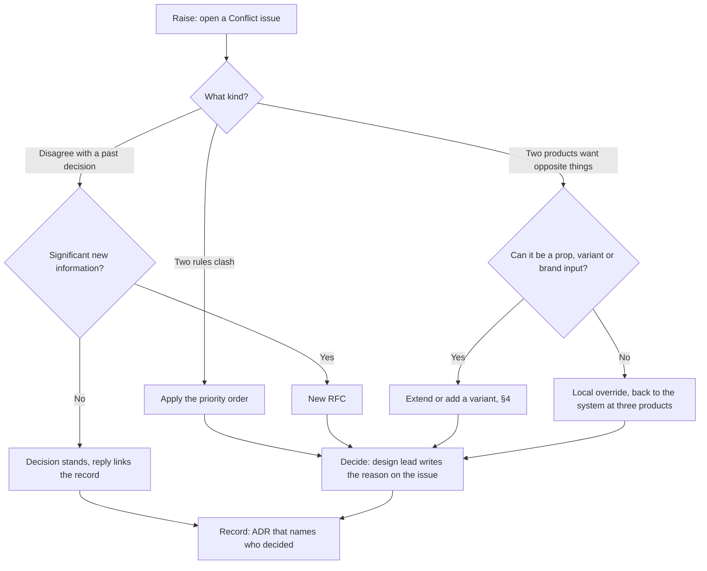

# Governance

How Syntara changes: who decides, how a request gets in, and how something gets out again without breaking the products that use it.

> **What's real today.** Syntara is a portfolio project with one maintainer, Anuj Patel, who pairs with AI agents. The roles and review times below are written for a team, so the process can be judged as one. Where a rule is enforced by a script, the command is next to it. Where it isn't enforced yet, this file says so.

## 1. Principles

1. **A brand is data, not code.** No change may fork a component for one tenant.
2. **Accessible by construction.** A change that lets a theme or component fail WCAG 2.2 AA doesn't ship.
3. **The cheapest outcome that meets the need wins** (§4).
4. **Nothing is removed without a way out.** Every breaking change ships with a codemod (§5).
5. **Every decision names who made it.** A person, or an agent's recommendation that a person accepted.

## 2. Who decides what

| Decision | Decided by | Recorded in |
|---|---|---|
| Visual design, API names, what is and isn't a component | Design lead (Anuj) | ADR or RFC |
| A fix, or a new prop that fits a component's purpose | Any maintainer, after review | Pull request |
| A new variant | Design lead | Pull request + ADR if there's a trade-off |
| A new component, breaking change, deprecation or token-tier change | Design lead, after an RFC | RFC + ADR |
| A component's maturity level | Design lead; the automated criteria must pass first | `meta.json`, checked by `pnpm check:meta` |
| A release | Maintainer | Changeset + changelog |

Agents may recommend any of these. They decide none of them (§6).

## 3. How a change gets in

1. **Issue.** Describe the need and the screen it's for (`.github/ISSUE_TEMPLATE`).
2. **RFC**, when one is needed. Copy `docs/rfcs/000-template.md`.
3. **Design review.** The design lead signs off on the API, states and tokens.
4. **Build.** Component, `meta.json`, examples and tests together.
5. **Docs.** Component pages are generated from `meta.json`, so docs ship with the code.
6. **Release.** A changeset describes the change for consumers.

**An RFC is needed for:** a new component · a breaking change · a deprecation · a change to the token tiers or to what the engine guarantees.
**Not for:** a fix · a new prop that fits a component's purpose · docs · a new example.

**Review times** for a team of this shape. With one maintainer these are targets, not a service level:

| Step | Target |
|---|---|
| First reply to an issue | 2 working days |
| RFC decision | 5 working days after it's marked "In review" |
| Pull request review | 2 working days |
| Accessibility bug that blocks use | Fix or workaround in the next patch release |

## 4. Extend, vary, add or override

Every request ends in one of four outcomes. Try them in this order.

| # | Outcome | Choose it when | Needs |
|---|---|---|---|
| 1 | **Extend** a component | The need fits the component's purpose and a new prop covers it | Pull request |
| 2 | **Add a variant** | Same job, a new visual style that every tenant can use | Design lead's sign-off |
| 3 | **Add a component** | A job no existing component does, needed on more than one screen | RFC |
| 4 | **Local override** | One product, one screen. It stays in the product and out of the system | Nothing from the system |

Questions that decide it:

- **Does an existing component already do this job?** Then extend it or add a variant.
- **Would every tenant use it?** If only one would, it's a local override.
- **Can it be built from tokens and existing components?** Then it may be a pattern or a block, not a component.
- **Does it need a tenant's name in the code?** Then it's the wrong design. A brand is data.

A local override that turns up in three products is a request for the system. Open an issue.

## 5. Versioning and deprecation

### Versions

- Packages follow [semver](https://semver.org) through [Changesets](https://github.com/changesets/changesets). Any change to a published package needs a changeset: `pnpm changeset`.
- The changelog is generated from changesets. The docs site's changelog page is the summary written for people.

### What counts as breaking

Removing or renaming a component, prop, prop value or token · changing a default · changing a `data-*` attribute a consumer could target in CSS · changing the rendered element or role · raising a peer dependency's major version.

Not breaking: a new optional prop, a new token, a visual refinement that keeps size and contrast, a fix that makes behaviour match the docs.

### The policy

1. **Deprecate in a minor release.** The old API keeps working and renders exactly as before.
2. **Remove in the next major release.**
3. **Before 1.0:** semver lets a 0.x minor release break things. Syntara doesn't use that. A deprecated API keeps working through every 0.x release and is removed at **1.0.0**.
4. **Every breaking change ships with a codemod** in `@syntara/codemods`. A codemod rewrites what it can be sure of and reports the rest; it never guesses.
5. **Alpha components are exempt.** Their API may change in any release. Beta and stable components change only through this policy.

### What a deprecation includes

| Part | Where | Checked by |
|---|---|---|
| An accepted RFC | `docs/rfcs/` | `pnpm check:meta` (the file exists) |
| A deprecation record: since, removal, replacement, reason, codemod, RFC | the component's `meta.json` | `pnpm check:meta` |
| A notice on the component's docs page | generated from `meta.json` | — |
| A note in the doc comment | `@deprecated` for a whole prop or component. For one value of a prop, plain words: TypeScript can't deprecate a single value, and the tag would strike through every use of the prop | Review |
| A warning in development, once, never in production | the component | its tests |
| A codemod with fixture tests | `packages/codemods` | `pnpm --filter @syntara/codemods test` |
| The codemod run on this repo | the pull request's diff | review |
| A changeset and a changelog entry | `.changeset/`, docs changelog | review |

Tokens follow the same policy. A deprecated token carries `com.syntara.deprecated` under `$extensions` in the DTCG export. No token has been deprecated yet, so that path is designed but not built.

### Deprecations so far

| What | Replacement | Since | Removed in | RFC |
|---|---|---|---|---|
| `Button variant="danger"` | `tone="danger"` | 0.2.0 | 1.0.0 | [RFC-001](docs/rfcs/001-button-tone.md) |

## 6. Agent trust levels

AI agents change code too. How much they may do alone depends on how far a change reaches and how easily it's undone ([ADR-008](docs/adr/008-agent-trust-levels.md)).

| Level | Agents may | People |
|---|---|---|
| **Ambient** | Fix token drift in consumer code, where there's one safe answer | See it in the diff |
| **Soft gate** | Open pull requests for docs, `meta.json` and stories | Approve |
| **Hard gate** | Draft RFCs and propose new components, token-tier changes and breaking changes | Decide the RFC, review the design, merge |

Agents can't merge. **Not enforced yet:** CODEOWNERS, branch protection and the drift auditor arrive in Phase 5. Until then this is a working agreement, kept by recording who decided in every ADR, RFC and log entry.

## 7. Maturity

Every component is alpha, beta or stable. The criteria, and how each is checked, are on the docs site under Governance → Maturity. `pnpm check:meta` enforces the ones a script can check.

## 8. Decision records

- **ADRs** (`docs/adr/`) record decisions with a design trade-off: context, decision, alternatives, consequences. One page each.
- **RFCs** (`docs/rfcs/`) propose a change before it's built.
- **The log** (`docs/log.md`) records each session: changed, decided, results, next.

An accepted ADR or RFC isn't rewritten. A change of mind is a new record that supersedes the old one.

## 9. When things conflict

Most requests go through §3 and §4 without a fight. This section is for the ones that don't. Every conflict follows one path: **raise, sort, decide, record.** Where each step comes from is in [the research note](docs/research/2026-10-04-conflict-management.md).

**1. Raise.** Open a *Conflict* issue (`.github/ISSUE_TEMPLATE/conflict.yml`). It asks what clashes, which screen or product it affects, and which of the three kinds it is.

**2. Sort.** Every conflict is one of three kinds.

- **Two rules clash.** In case of conflict: **accessibility over not breaking consumers over brand wishes over speed.** The higher one wins, without a debate. Accessibility means WCAG 2.2 AA (principle 2). Not breaking consumers means §5: no removal without a way out. A brand wish is anything a tenant wants that the first two don't require. The form of this rule is borrowed from the W3C's *priority of constituencies*.
- **Someone disagrees with a past decision.** A decision is reopened only with significant new information: a measurement, a bug, a user need nobody knew about when it was made. Disagreeing with the trade-off is not new information. Without it, the decision stands and the reply links the ADR or RFC that made it. With it, the change is a new RFC, and an accepted record is superseded rather than rewritten (§8). The rule is John Ousterhout's, as used by the Go project.
- **Two products want opposite things.** First ask whether both can be served by a prop, a variant or a brand input. A brand is data, so a difference between tenants usually belongs in `brand.json`, not in a fork (principle 1). If neither fits, it stays a local override in the product that needs it (§4). When the same override turns up in three products, it comes back as a request for the system (Robert Glass's rule of three).

**3. Decide.** The design lead decides, within the review times in §3, and writes the reason on the issue. A conflict that the priority order settles still gets a one-line reply naming which rule won.

**4. Record.** Every decided conflict ends in an ADR whose *Decided by* line names a person (§1, principle 5). A conflict settled by an existing record links that record instead of making a new one.

**Not enforced yet:** nothing checks that a conflict issue ends in a record. It's a working agreement, like §6.
